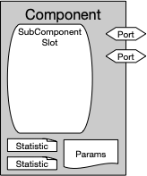

<!---
SAND2022-6843 O
Source: sst-documentation/manuals/python
--->

The Component and SubComponent Python classes represent the Component and SubComponent C\+\+ classes that are used to implement the simulation models used in SST. They are similar, and have similar APIs, but SubComponents can only exist inside of Components. Subsequently, Components are instanced directly, but SubComponents are only instanced through a Component or another SubComponent. 

The figures below show the main structures of the Component/SubComponent objects. The right image illustrates the arbitrary nesting capability of SubComponents.

 

* [Create a Component](../component)
* [Create a SubComponent](setSubComponent)
* [Create a PortModule](addPortModule)
