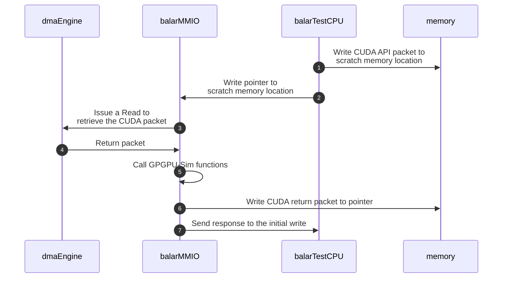
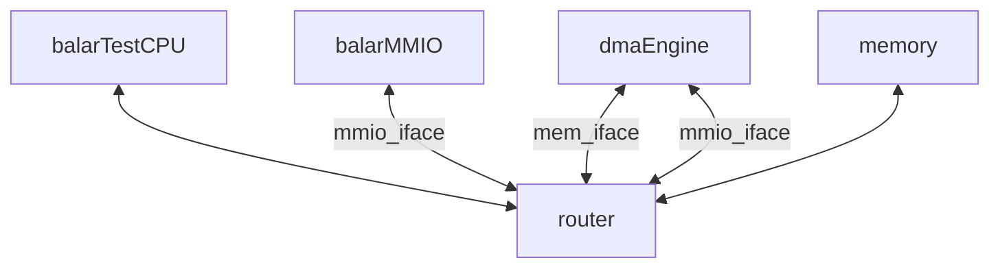
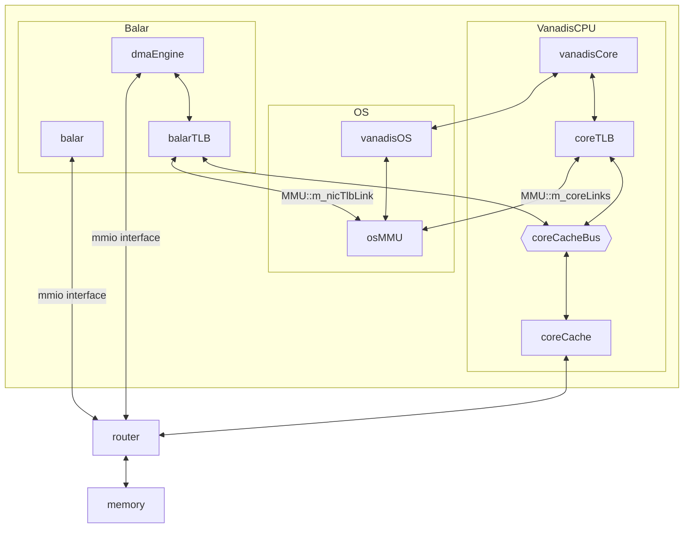

This doc provide some high level views on various aspects of *balar*.

## balar CUDA calls dispatch mechanism

In *balar*, every CUDA API call and return are represented by `SST::BalarComponent::BalarCudaCallPacket_t` and `SST::BalarComponent::BalarCudaCallReturnPacket_t`. These two structures contain necessary arguments for CUDA function calls and return values.

Since *balar* is a [MMIO](https://sst-simulator.org/sst-docs/docs/elements/memHierarchy/stdmem#mmio) (memory mapped IO) device, it receives CUDA call packets via incoming writes to its mapped address. Specifically, it follows the dispatch sequence as follow:

:::note

*BalarTestCPU* writes the pointer to the CUDA packet into *balar*'s MMIO address range, which *balar* will use this to copy the actual packet content into simulator memory space.

:::

:::note

With direct-execution, there are some differences with `cudaMemcpy()` function calls. Specifically, *balar* will need to copy data from SST memory system with `cudaMemcpyHostToDevice` and copy data from simulator memory space into SST memory with `cudaMemcpyDeviceToHost` using *dmaEngine*.

:::

## Custom CUDA runtime library

Located in `src/sst/elements/balar/tests/vanadisLLVMRISCV`, the custom runtime lib `cuda_runtime_api_vanadis.cc` will be linked with CUDA programs. For most CUDA APIs, it will create `SST::BalarComponent::BalarCudaCallPacket_t` packets and send pointers to the packets to *balar*.

For each CUDA call using `makeCudaCall()`, *balar* will first map its MMIO into *vanadis*'s virtual memory with memory fencing ops first. The actual `mmap` call is performed via inline assembly code to avoid invalid accesses into *balar*'s MMIO address due to OoO execution. *Balar* will unmap immediately after pointer is written for the same reason.

- For blocking CUDA calls, *balar* will poll on the last CUDA API return status via `readLastCudaStatus()` until the operation is completed.
- For non-blocking CUDA calls, *balar* will return immediately.

## Trace-driven mode component setup

We provided a config script `src/sst/elements/balar/tests/testBalar-testcpu.py` to run with trace information. The configuration graph roughly looks like this:

*dmaEngine* has two memory interfaces. One for receiving commands (`mmio_iface`) and the other is used to access data (`mem_iface`).

## Direct-execution mode component setup

For direct-execution with *vanadis*, the config script is at `src/sst/elements/balar/tests/testBalar-vanadis.py`, with configuration graph:

:::note

Some details are omitted for simplicity.

:::

:::note

*balar* needs a TLB as *vanadis* works in virtual memory space. That part of the configuration script is based on the test example for [*rdmaNic*](../rdmaNic/intro.md).

:::
