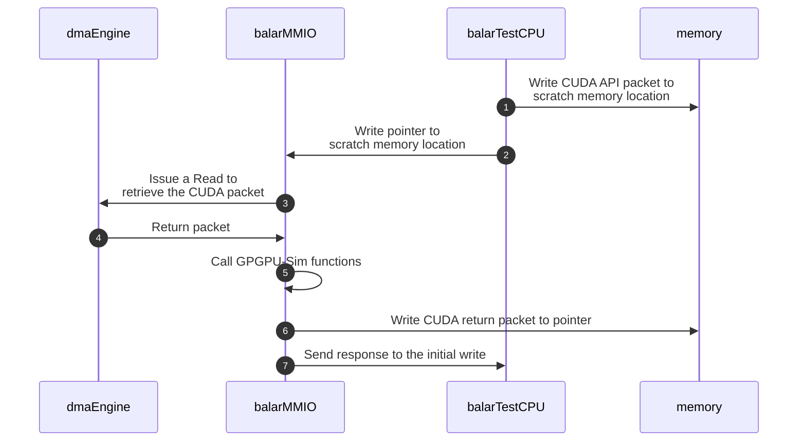
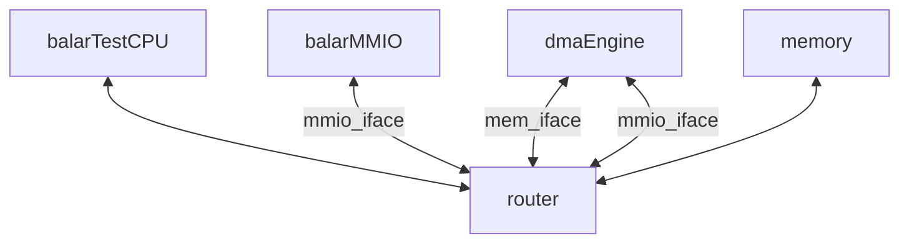
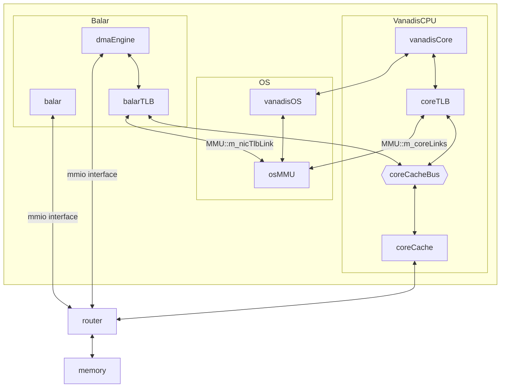

This doc provide some high level views on various aspects of *balar*.

## balar CUDA calls dispatch mechanism

In *balar*, every CUDA API call and return are represented by `SST::BalarComponent::BalarCudaCallPacket_t` and `SST::BalarComponent::BalarCudaCallReturnPacket_t`. These two structures contain necessary arguments for CUDA function calls and return values.

Since *balar* is a [MMIO](https://sst-simulator.org/sst-docs/docs/elements/memHierarchy/stdmem#mmio) (memory mapped IO) device, it receives CUDA call packets via incoming writes to its mapped address. Specifically, it follows the dispatch sequence as follow:



:::note

*BalarTestCPU* writes the pointer to the CUDA packet into *balar*'s MMIO address range, which *balar* will use this to copy the actual packet content into simulator memory space.

:::

:::note

With direct-execution, there are some differences with `cudaMemcpy()` function calls. Specifically, *balar* will need to copy data from SST memory system with `cudaMemcpyHostToDevice` and copy data from simulator memory space into SST memory with `cudaMemcpyDeviceToHost` using *dmaEngine*.

:::

### CUDA stream support

*balar* supports CUDA streams through a lightweight stream manager (`pending_packets_per_stream` in `balarMMIO.h`) that tracks every stream operation for every stream, similar to the `stream_manager` class in GPGPU-Sim. In fact, `pending_packets_per_stream` is just a mirror of `stream_manager`. This is needed due to different designs between GPGPU-Sim and SST.

#### Why `pending_packets_per_stream` is needed

In GPGPU-Sim, the CUDA frontend is run on a separate thread than the backend simulation (i.e. the `cycle()` function), meaning these two are **decoupled**:

1. The frontend handling does not need to sync with the performance simulation.
2. It can just push incoming CUDA stream operations to the `stream_manager` class and let the backend consume the stream ops.
   1. In this case, when frontend deals with a blocking CUDA request, it will simply busy wait on the backend to drain the corresponding stream.
   2. This works as frontend and backend in original GPGPU-Sim can be run freely without synchronizations.

But with SST, the frontend and backend are **coupled** together in balar, so extra callback functions and the `pending_packets_per_stream` operation tracking are needed to prevent deadlocks due to the original decoupled design.
Which won't be solved by simply breaking the frontend and backend handling into different components within SST without any modification in the GPGPU-Sim side. This is because SST simulation will progress if at a given cycle, all the event handlings are done. However, for handling CUDA operation:

1. The frontend will be handled in an event handler.
2. The backend simulation will be in a clock tick function.

This can easily lead to **deadlock**. Consider a scenario in *balar* when a blocking CUDA request is sent to frontend handler with some active ops already in the stream of the incoming blocking request:

1. In GPGPU-Sim, the stream manager will **busy waiting** on if the corresponding stream is empty, which is not in this case.
2. However, the existing stream ops will only progress if the backend `cycle()` in GPGPU-Sim is called.
3. But the `cycle()` will only be called in the next cycle of SST.
4. The next cycle will not come as the event handling in the frontend handler is not done.
5. Thus, a deadlock: `frontend -> stream manager -> backend -> next cycle -> frontend`

#### `pending_packets_per_stream` insertion and removal

Upon a stream operation, CUDA call packet will be inserted to `pending_packets_per_stream` at the corresponding stream. Some example patterns are listed below:

```CPP
// Pattern 1: Memory Operations (Memcpy)
case CUDA_MEMCPY: {
    // Create a copy of the packet
    BalarCudaCallPacket_t * packet_copy = new BalarCudaCallPacket_t(*packet);
    // Insert into default stream's pending packet queue
    balar->pending_packets_per_stream.at(0).push(packet_copy);
}

// Pattern 2: Async Memory Operations
case CUDA_MEMCPY_ASYNC: {
    // Create a copy of the packet
    BalarCudaCallPacket_t * packet_copy = new BalarCudaCallPacket_t(*packet);
    // Insert into specific stream's pending packet queue
    balar->pending_packets_per_stream.at(packet_copy->cudaMemcpyAsync.stream).push(packet_copy);
}

// Pattern 3: Kernel Launch
case CUDA_LAUNCH: {
    // Create a copy of the packet
    BalarCudaCallPacket_t * packet_copy = new BalarCudaCallPacket_t(*packet);
    // Insert into the configured stream's queue
    balar->pending_packets_per_stream.at(config_stream).push(packet_copy);
}
```

Once the corresponding stream operation is completed (via `SST_callback_event_done()` callback called from GPGPU-Sim), packet will be removed from `pending_packets_per_stream`:

```CPP
void BalarMMIO::SST_callback_event_done(const char* event_name, cudaStream_t stream, 
    uint8_t* payload, size_t payload_size) {
    
    // Get reference to the stream's queue
    auto& stream_queue = pending_packets_per_stream.at(stream);
    // Get the head packet
    BalarCudaCallPacket_t * head_packet = stream_queue.front();
    
    // Process different types of completion events
    if (event_string == "memcpy_H2D_done") {
        // Handle H2D completion
        // ... process completion ...
    } else if (event_string == "memcpy_D2H_done") {
        // Handle D2H completion
        // ... process completion ...
    } else if (event_string == "Kernel_done") {
        // Handle kernel completion
        // ... process completion ...
    }
    
    // Remove the completed packet from the queue
    stream_queue.pop();
}
```

## Custom CUDA runtime library

Located in `src/sst/elements/balar/tests/vanadisLLVMRISCV`, the custom runtime lib `cuda_runtime_api_vanadis.cc` will be linked with CUDA programs. For most CUDA APIs, it will create `SST::BalarComponent::BalarCudaCallPacket_t` packets and send pointers to the packets to *balar*.

For each CUDA call using `makeCudaCall()`, *balar* will first map its MMIO into *vanadis*'s virtual memory with memory fencing ops first. The actual `mmap` call is performed via inline assembly code to avoid invalid accesses into *balar*'s MMIO address due to OoO execution. *Balar* will unmap immediately after pointer is written for the same reason.

- For blocking CUDA calls, *balar* will poll on the last CUDA API return status via `readLastCudaStatus()` until the operation is completed.
- For non-blocking CUDA calls, *balar* will return immediately.

## Trace-driven mode component setup

We provided a config script `src/sst/elements/balar/tests/testBalar-testcpu.py` to run with trace information. The configuration graph roughly looks like this:



*dmaEngine* has two memory interfaces. One for receiving commands (`mmio_iface`) and the other is used to access data (`mem_iface`).

## Direct-execution mode component setup

For direct-execution with *vanadis*, the config script is at `src/sst/elements/balar/tests/testBalar-vanadis.py`, with configuration graph:



:::note

Some details are omitted for simplicity.

:::

:::note

*balar* needs a TLB as *vanadis* works in virtual memory space. That part of the configuration script is based on the test example for [*rdmaNic*](../rdmaNic/intro.md).

:::
