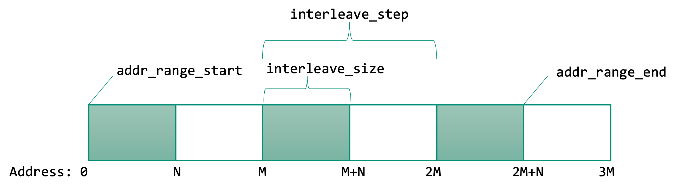

MemHierarchy operates on a physical address space in which components can map either contiguous memory regions or can map regions interleaved at regular intervals. When units are required, be specific with whether you intend base-10 (e.g., GB) or base-2 (e.g., GiB).

These parameters are used across components to define memory regions:
* **addr_range_start** The first (smallest) address that maps to this component. Default is 0.
* **addr_range_end** The largest address that maps to this component. Default is `uint64_t-1`.
* **interleave_size** The size of each interleaved chunk that is mapped to this component. 
* **interleave_step** The distance between starting addresses of consecutive chunks that are mapped to this component

In the picture, these parameters are shown for interleaving chunks of addresses across two components.


**Restrictions:** For any request that arrives at a component, that component must always be able to identify a single next-level component to forward the request to.
Therefore:
* A physical address may only map to *one* component within a single shared level of the memory hierarchy (shared cache, directory, memory).
* Holes in address interleavings are allowed as long as the addresses are unused.

### Example: Consecutive mapping
This input config snippet shows three memory controllers dividing 4GiB of memory space among them. There is no interleaving so those parameters are not used. Note that each address range is inclusive and does not overlap with the next controller's range.

```py
memory0 = sst.Component("memory0", "memHierarchy.MemController")
memory1 = sst.Component("memory1", "memHierarchy.MemController")
memory2 = sst.Component("memory2", "memHierarchy.MemController")

# Memory 0 addresses 0-1GiB
memory0.addParam("addr_range_start", 0)          # 0GiB
memory0.addParam("addr_range_end", 1073741823)   # 1GiB - 1
# Memory 1 addresses 1-3GiB
memory1.addParam("addr_range_start", 1073741824) # 1GiB
memory1.addParam("addr_range_end", 3221225471)   # 3GiB - 1
# Memory 2 addresses 3-4GiB
memory2.addParam("addr_range_start", 3221225472) # 3GiB
memory2.addParam("addr_range_end", 4294967295)   # 4GiB - 1
```


### Example: Interleaved mapping
This example shows how 4GiB of memory might be striped evenly across three memory controllers at 1MiB granularities. `addr_range_end` is the same for all controllers because the interleaving prevents the three controllers from trying to map the same chunks of memory.
```py
memory0 = sst.Component("memory0", "memHierarchy.MemController")
memory1 = sst.Component("memory1", "memHierarchy.MemController")
memory2 = sst.Component("memory2", "memHierarchy.MemController")

# Memory 0 addresses 0-1GiB
memory0.addParam("addr_range_start", 0)        # 0MiB
memory0.addParam("addr_range_end", 4294967295) # End interleaving at 4GiB - 1
memory0.addParam("interleave_size", "1MiB")     # Each chunk mapped to this controller is 1MiB
memory0.addParam("interleave_step", "3MiB")     # This controller maps addresses at 3MiB intervals

# Memory 1 addresses 1-3GiB
memory1.addParam("addr_range_start", 1048576) # 1MiB
memory1.addParam("addr_range_end", 4294967295)   # End interleaving at 4GiB - 1
memory1.addParam("interleave_size", "1MiB")     # Each chunk mapped to this controller is 1MiB
memory1.addParam("interleave_step", "3MiB")     # This controller maps addresses at 3MiB intervals

# Memory 2 addresses 3-4GiB
memory2.addParam("addr_range_start", 2097152)  # 2MiB
memory2.addParam("addr_range_end", 4294967295) # End interleaving at 4GiB - 1
memory2.addParam("interleave_size", "1MiB")     # Each chunk mapped to this controller is 1MiB
memory2.addParam("interleave_step", "3MiB")     # This controller maps addresses at 3MiB intervals

```

For components that accept these addressing parameters, there is no requirement that addresses be striped uniformly. For example, one could stripe the first 3GiB of the address space to controllers `memory0` and `memory1` with 2MiB chunks mapping to `memory0` and 1MiB chunks mapping to `memory1` and then assign the final 1GiB chunk to `memory2` in a contiguous mapping as shown below.

```py
memory0 = sst.Component("memory0", "memHierarchy.MemController")
memory1 = sst.Component("memory1", "memHierarchy.MemController")
memory2 = sst.Component("memory2", "memHierarchy.MemController")

# Divide the first 3GiB of memory space into 3MiB chunks
# Memory 0 maps the first 2MiB of each chunk
memory0.addParam("addr_range_start", 0)
memory0.addParam("addr_range_end", 3221225471)
# Memory 1 maps the final 1MiB of each chunk
memory1.addParam("addr_range_start", 1073741824) # 1GiB
memory1.addParam("addr_range_end", 3221225471)   # 3GiB - 1
# Memory 2 addresses 3GiB-4GiB
memory2.addParam("addr_range_start", 3221225472) # 3GiB
memory2.addParam("addr_range_end", 4294967295)   # 4GiB - 1
```

## SI Units and base-10 vs base-2
While "GB" and "GiB" are often used interchangeably in the context of memory, be specific in simulator input. In some cases, for legacy reasons, memHierarchy will automatically translate a base-10 SI prefix (e.g., MB) to base-2 (e.g, MiB) but it does not do so universally as sometimes base-10 is desired. If a parameter is always interpreted as base-2, that will be noted in the parameter description.
