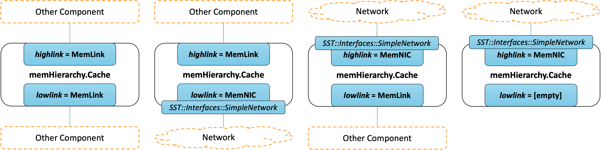

All MemHierarchy caches, regardless of level or type (shared, private, inclusive, noninclusive, etc.) use the same component, `memHierarchy.Cache` which is implemented in the `SST::MemHierarchy::CacheController` class. This picture shows the component structure. The light blue boxes show the available subcomponent slots. The cache has a number of ports which are not shown; it is recommended instead to use the `cpulink` and `memlink` subcomponents which have their own ports.

## coherence
This subcomponent handles incoming events and sends outgoing ones according to the configured coherence protocol (or lack thereof). The cache component decides which coherence subcomponent to load depending on the parameters `L1`, `coherence_protocol`, and `cache_type`. Users should not explicitly load a subcomponent into this slot in the input file. The table below shows different combinations of parameters and which subcomponent gets loaded. Any combination of parameters not listed (for example, `L1`=true, `coherence_protocol`=mesi and `cache_type`=noninclusive) is an invalid combination.

| `L1`  | `coherence_protocol`  | `cache_type`                  | SubComponent                          |
| ---   | ---                   | ---                           | ---                                   |
| true  | mesi, msi             | inclusive                     | `coherence.mesi_l1`                   |
| true  | none                  | inclusive                     | `coherence.incoherent_l1`             |
| false | mesi, msi             | inclusive                     | `coherence.mesi_inclusive`            |
| false | mesi, msi             | noninclusive                  | `coherence.mesi_private_noninclusive` |
| false | mesi, msi             | noninclusive_with_directory   | `coherence.mesi_shared_noninclusive`  |
| false | none                  | noninclusive                  | `coherence.incoherent`                |

## replacement
This subcomponent implements the cache replacement policy. It can be loaded by the user explicity in the input file, otherwise it will be inferred from the `replacement_policy` cache parameter. A number of policies are included in memHierarchy but custom ones from other libraries can also be used by explicitly loading them in the input file. If the cache coherence configuration uses multiple cache arrays (e.g., a non-inclusive cache and directory), multiple replacement policies can be loaded in the slot. 

### replacement.lru
LRU is a **l**east-**r**ecently-**u**sed policy. The timestamp of the most recent access to each line in a cache set is tracked and the line with the oldest timestamp is replaced.

### replacement.lru-opt
LRU-opt is similar to LRU (`replacement.lru`) but is optimized to reduce coherence traffic in shared inclusive caches. If a line is unshared or unowned, it is preferred for replacement regardless of the LRU timestamp. Two lines with similar shared/owned status will use the LRU timestamp to determine the victim line.

### replacement.lfu
This policy implements a **l**east-**f**requently-**u**sed algorithm to replace blocks. Each access $x$ updates block $A$'s replacement weight ($weight_{A,x}$) as follows. $weight$ increments by 1000 each time a line in a set is accessed. The increment creates space between different lines' $weight_{A,x}$ values. 

$$
weight_{A,x} = (accesses_{A,x-1}*weight_{A,x-1} + weight)/(accesses_{A,x-1} + 1)
$$
$$
accesses_{A,x} = accesses_{A,x-1} + 1
$$
$$
weight = weight + 1000
$$

### replacement.lfu-opt
This policy is similar to `replacement.lfu` but is optimized to reduce coherence traffic in shared inclusive caches. To that end, the policy will prefer to evict a block that is unowned and unshared, but, given two blocks with similar sharing/owned status, will fall back to using the $weight_x$ as defined above to determine the victim line.

### replacement.mru 
This policy implements a **m**ost-**r**ecently-**u**sed algorithm to determine which line in a set should be replaced. The timestamp of the most recent access to each line is compared and the most-recently accessed line is replaced.

### replacement.mru-opt
This policy is similar to `replacement.mru` but is optimized to reduce coherence traffic in shared inclusive caches. To that end, the policy will prefer to evict a block that is unowned and unshared, but, given two blocks with similar sharing/owned status, will fall back to using the most-recently-used timestamps to determine the victim line.

### replacement.random
The random replacement policy randomly selects one of the blocks in the cache set to replace. It uses SST's [Marsaglia generator](../../core/rng/marsaglia). 

### replacement.nmru
This is a **n**ot-**m**ost-**r**ecently-**u**sed policy. Only the most recently used line in each set is tracked. A victim is randomly selected from the remaining lines. NMRU uses the [Marsaglia random number generator](../../core/rng/marsaglia).

## hash
The hash slot loads a function that is used to map physical addresses to lines in the cache array. The subcomponent can be set explicitly in the input file or can be controlled using the cache's `hash` parameter. The only way to pass parameters to the hash subcomponent is to load it explicitly in the SST input file. By default, the cache loads a pass-through subcomponent that does not hash addresses.

### hash.none
This subcomponent does not do any manipulation of the address passed to it. It is the default function used in the cache if none is specified.
$$
addr_{out} = addr_{in}
$$

### hash.linear
This function does a linear hash of the address as shown.
$$
addr_{out} = 1103515245*addr_{in} + 12345
$$

### hash.xor
This function does a simple XOR hash, XOR'ing each byte, $b_i$ in the input address with the next byte $b_{i+1}$, to obtain an output.
$$
b_{out,i} = b_{in,i} \oplus b_{in,i+1}
$$

## prefetcher
Loading a prefetcher is optional. When loaded, the cache will notify the prefetcher of every cache access and its result (hit or miss). The prefetch subcomponent can then send prefetch requests to the cache. Prefetcher subcomponents are implemented using the `MemHierarchy::CacheListener` interface. Currently, all SST-provided prefetchers reside in the `cassini` library.

The cache has three parameters related to prefetch performance. The first, `prefetch_delay_cycles`, causes each prefetch sent by the prefetcher subcomponent to be delayed by some number of cycles before being handled. This compensates for prefetchers that do not implement their own timing and can issue prefetches in the same cycle that they receive notification of a cache access. The second and third parameters, `max_outstanding_prefetch` and `drop_prefetch_mshr_level`, allow the cache to throttle the amount of traffic generated by a prefetcher. `max_outstanding_prefetch` limits the total number of prefetch misses allowed at one time. `drop_prefetch_mshr_level` allows the cache to drop a prefetch if handling it would cause the MSHR occupancy to rise above the specified level.

## listener
The `listener` subcomponent is nearly identical to the `prefetcher` and uses the same `CacheListener` API. Both receive notification of every request handled by the cache. The difference is that while the `prefetcher` can send requests to the cache, a listener cannot. Listeners can be used to snoop traffic, generate traces, etc. Multiple listeners can be loaded into this slot. 

## cpulink and memlink
The `cpulink` and `memlink` subcomponent slots each load a memory link manager subcomponent that controls how the cache connects to other memory system components. These are intended to be used *instead of* the cache ports. `cpulink` can be thought of as the link on which requests are received (typically, the link towards a CPU or other processing element) while `memlink` is the link towards the memory, or, where the cache sends requests if the cache cannot handle them itself. Both subcomponents use the `MemHierarchy::MemLinkBase` API. MemHierchy provides three subcomponents that can be loaded into these slots: `MemLink`, `MemNIC`, and `MemNICFour`.

The picture above shows the different ways to configure these subcomponent slots. A couple things to note:
* The cache generally expects requests ***from*** the `cpulink` and will forward requests that miss in the cache ***to*** the `memlink`.
* "Other Component" means any other memHierarchy component or a non-memHierarchy component that uses the memHierarchy `SST::Interfaces::StandardMem` interface (`memHierarchy.standardInterface`). Any time the cache links to one of these, the `memHierarchy.MemLink` subcomponent should be used. This includes when linking to `memHierarchy.Bus`.
* "Network" means any network model that implements the `SST::Interfaces::SimpleNetwork` interface. Any time the cache links to other components through a network, the `memHierarchy.MemNIC` (or `memHierarchy.MemNICFour`) subcomponent should be used.
* MemNIC (and MemNICFour) in turn load subcomponent(s) that implement the `SST::Interfaces::SimpleNetwork` interface.
* If the cache is only connected to other components through a network, put a MemNIC (or MemNICFour) in the `cpulink` slot and leave the `memlink` slot empty. Traffic that the cache would have sent to the `memlink` will be sent through the `cpulink` subcomponent.

### MemLink
This is the default link manager, and is used when a cache connects directly to another component rather than over a network. Examples include connecting to the memHierarchy interface loaded by a CPU, another cache, or the memHierarchy Bus component. 

### MemNIC
MemNIC is used when the cache is connected to a network. If the cache has a single connection point into the network, the `cpulink` slot should contain the link manager and the `memlink` slot can be left empty.

### MemNICFour
Like MemNIC, MemNICFour is used to connect the cache to a network. However, it has four separate ports for different coherence traffic classes (request, data, acknowledgement, forward). MemHierarchy does not rely on separating coherence classes for correctness and so either the MemNIC (single network) or MemNICFour (multiple networks) subcomponents can be used depending on the architecture to be modeled. 

