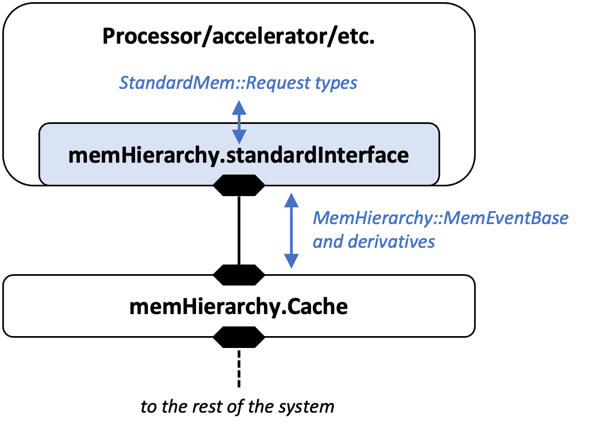

MemHierarchy implements the [`SST::Interfaces::StandardMem`](../../core/iface/StandardMem/class) API for integration with a processor model. The picture below shows how components like processors, accelerators, etc. interface with memHierarchy using `StandardMem`. The processor or other "endpoint" exchanges StandardMem requests with memHierarchy's StandardMem API implementation, `standardInterface`. The implementation handles translating requests into MemHierarchy's internal event types. To use the interface, a processor should load the `memHierarchy.standardInterface` subcomponent and connect the subcomponent's port to a memHierarchy component as shown. 

Even though the picture shows the processor connected to a cache, the same `memHierarchy.standardInterface` subcomponent also supports connections to scratchpads, memory controllers, and networks with memHierarchy components on them. This page discusses how memHierarchy implements the interface and assumptions it makes, as well as specifics about how particular memHierarchy components treat various request types. The `memHierarchy.standardInterface` subcomponent is implemented by the `MemHierarchy::StandardInterface` class. 

## Requests versus Events
In SST terminology, an *Event* is an object that can be passed over an SST *Link*. Events inherit from `SST::Event`. `StandardMem::Request` and derivatives such as `StandardMem::Read` or `StandardMem::WriteResp` are not events in this sense and are exchanged with the StandardMem interface using function calls. MemHierarchy then translates these *requests* to events in the SST sense. To avoid confusion between (SST) events and requests, this guide refers to `StandardMem::Request` derivatives as 'requests', whether the object represent an actual request (e.g., read) or a response. For requests that get translated into a MemHierarchy event, it also gives the event type. 
This diagram shows the inheritance structure of MemHierarchy events, with base classes to the left.

## Requests Sent to MemHierarchy's StandardInterface
These are requests that are sent from a processor or other endpoint into memHierarchy. 
Interpret "request sent to memHierarchy" to mean a request sent to `MemHierarchy::StandardInterface` using StandardMem's `void send(Request* req)` function.

### [StandardMem::Read](../../core/iface/StandardMem/req/read.md)
A `Read` request sent to memHierarchy is interpreted as a read of the specified physical address. All memHierarchy components support reads.

#### StandardMem::Read fields
* `pAddr` (physical address) - the physical byte address where the read should start. MemHierarchy will use this to compute a cache line address for cacheable requests.
* `size` - number of bytes to be read, starting at `pAddr`. MemHierarchy does *not* split requests that span cache lines or memory controller address spaces. See the Assumptions below.
* `flags` - `F_NONCACHEABLE` is supported. If set, memHierarchy components will forward the request until it reaches the appropriate memory controller. Noncacheable requests do not query caches for potential hits and are not checked against outstanding cacheable requests for conflicts.
* `vAddr` (virtual address) - unused by memHierarchy. It is appended to memHierarchy events to aid debugging.
* `iPtr` (instruction pointer) - unused by memHierarchy. It is appended to memHierarchy events to aid debugging.
* `tid` (thread ID) - If a processor implements simultaneous multi-thread (SMT), this field should be set to the physical thread ID. The caches use this ID to disambiguate atomic accesses by different threads.

#### Assumptions
* A request must not span multiple cache lines (if cacheable) or multiple distinct memory controller address spaces (if noncacheable). MemHierarchy does *not* split requests. For performance reasons, MemHierarchy will only run checks to detect violations of these conditions if the SST-Core is compiled with `--enable-debug`. 

#### Response
`StandardMem::ReadResp`

#### MemEvent Translation
Internally, MemHierarchy translates `SST::StandardMem::Read` to `SST::MemHierarchy::MemEvent`. 
This table describes the translation of each field. Only relevant MemEvent fields are listed.

| MemEvent Field   | Description | How set | 
| ----     | ---- | --- |
| `eventID_` | Unique ID | Generated when event is generated. Does not match the `StandardMem::Read` ID. |
| `src_`     | Event source name | Updated by memHierarchy each time event is forwarded |
| `dst_`     | Event destination name | Updated by memHierarchy each time event is forwarded |
| `rqstr_`   | Event requestor | The name of the `memHierarchy.standardInterface` that originated the `StandardMem::Read` |
| `tid_`     | Thread ID | `StandardMem::Read::tid` |
| `cmd_`     | Command   | `MemHierarchy::Command::GetS` (Get-Shared) |
| `flags_`   | Flags     | Set to `MemEventBase::F_NONCACHEABLE` if `StandardMem::Read::flags == F_NONCACHEABLE` |
| `size_`    | Size      | `StandardMem::Read:size` |
| `addr_`    | Physical address | `StandardMem::Read:pAddr` |
| `baseAddr_` | Line address | For cacheable requests, this is calculated by `MemHierarchy::StandardInterface` using the detected cache line size. For noncacheable requests, this matches `addr_` |
| `instPtr_` | Instruction pointer | `StandardMem::Read::iPtr` |
| `vAddr_`   | Virtual address | `StandardMem::Read::vAddr` |

### [StandardMem::Write](../../core/iface/StandardMem/req/write.md)
A `Write` request sent to memHierarchy is interpreted as a write to the specified address. Writes to caches are performed in the cache after the block is obtained. Noncacheable writes and those sent to memory controllers are performed at the memory controller. Scratchpad writes occur in the scratchpad.

#### StandardMem::Write fields
* `pAddr` (physical address) - the physical byte address where the write should start. MemHierarchy will use this to compute a cache line address for cacheable requests.
* `size` - number of bytes to be written, starting at `pAddr`. MemHierarchy does *not* split requests that span cache lines or memory controller address spaces. See the Assumptions below.
* `data` - a vector of `uint8_t` containing the bytes to be written. If the processor does not use actual data, this field is not required. However, if its size is nonzero, the vector size should match the write's 'size' field.
* `posted` - if true, the write will not be acknowledged. By default, `posted` is false and memHierarchy will acknowledge every write.
* `flags` - `F_NONCACHEABLE` is supported. If set, memHierarchy components will forward the request until it reaches the appropriate memory controller. Noncacheable requests do not query caches for potential hits and are not checked against outstanding cacheable requests for conflicts.
* `vAddr` (virtual address) - unused by memHierarchy. It is appended to memHierarchy events to aid debugging.
* `iPtr` (instruction pointer) - unused by memHierarchy. It is appended to memHierarchy events to aid debugging.
* `tid` (thread ID) - If a processor implements simultaneous multi-thread (SMT), this field should be set to the physical thread ID. The caches use this ID to disambiguate atomic accesses by different threads.

#### Assumptions
* A request must not span multiple cache lines (if cacheable) or multiple distinct memory controller address spaces (if noncacheable). For performance reasons, MemHierarchy will only run checks to detect violations of these conditions if the SST-Core is compiled with `--enable-debug`. 
* The data vector should either be empty or its size should match the size field. Otherwise, both sizes will be used inconsistently. If SST-Core is compiled with `--enable-debug`, mismatched sizes will be detected and produce a warning.

#### Response
`StandardMem::WriteResp`

#### MemEvent Translation
MemHierarchy translates `StandardMem::Write` requests to `MemHierarchy::MemEvent` events.

| MemEvent Field | Description | How set | 
| ----     | ---- | --- |
| `eventID_` | Unique ID | Generated when event is generated. Does not match the `StandardMem::Write` ID. |
| `src_`     | Event source name | Updated by memHierarchy each time event is forwarded |
| `dst_`     | Event destination name | Updated by memHierarchy each time event is forwarded |
| `rqstr_`   | Event requestor | The name of the `memHierarchy.standardInterface` that originated the `StandardMem::Write` |
| `tid_`     | Thread ID | `StandardMem::Write::tid` |
| `cmd_`     | Command   | `MemHierarchy::Command::Write` |
| `flags_`   | Flags     | If `StandardMem::Write::flags == F_NONCACHEABLE`,`flags_` contains `MemEventBase::F_NONCACHEABLE`. If `StandardMem::Write::posted == true`,`flags_` contains `MemEventBase::F_NORESPONSE`. |
| `size_`    | Size      | `StandardMem::Write:size` if `StandardMem::Write::data` is empty, otherwise size of `StandardMem::Write::data` |
| `addr_`    | Physical address | `StandardMem::Write:pAddr` |
| `baseAddr_` | Line address | For cacheable requests, this is calculated by `MemHierarchy::StandardInterface` using the detected cache line size. For noncacheable requests, this matches `addr_` |
| `payload_` | `StandardMem::Write::data` if non-empty, otherwise a vector of size `StandardMem::Write::size` containing 0s. |
| `instPtr_` | Instruction pointer | `StandardMem::Write::iPtr` |
| `vAddr_`   | Virtual address | `StandardMem::Write::vAddr` |

### [StandardMem::FlushAddr](../../core/iface/StandardMem/req/flushaddr.md)
A `FlushAddr` request sent to memHierarchy flushes an address from cache and/or directory. 
Scratchpads do not handle flush requests and will error if one is received. 
Memory controllers do process flushes to support persistent memory. 
Flushes write dirty (written) data back to memory or a lower level cache 
and can optionally invalidate the flushed address from cache too. 
Flushes cause the line to be written back and/or evicted from all levels of cache. 
Flushing any part of a cache line will flush the entire line.

#### StandardMem::FlushAddr fields
* `pAddr` (physical address) - the physical byte address where the flush should start. For memory, this can be non-cache line aligned. For caches, a flush of any portion of the cache line will flush the entire line.
* `size` - number of bytes to flush, starting at `pAddr`. MemHierarchy does *not* split requests that span cache lines or memory controller address spaces. Cache flushes to any portion of a cache line will flush the entire line. See the Assumptions below.
* `inv` - if true, the flush will also invalidate the line from cache. If false, the flush will only write back dirty data.
* `depth` - NOT YET SUPPORTED. Once supported, this will be the number of memHierarchy levels to apply the flush to. For example, depth=1, will only flush the first cache or memory encountered. Depth=2 will flush the first two. If depth is equal to or greater than the number of components in the hierarchy, the flush will propagate all the way to memory. Currently, flushes propagate all the way to memory.
* `flags` - No standard flags supported.
* `vAddr` (virtual address) - unused by memHierarchy. It is appended to memHierarchy events to aid debugging.
* `iPtr` (instruction pointer) - unused by memHierarchy. It is appended to memHierarchy events to aid debugging.
* `tid` (thread ID) - If a processor implements simultaneous multi-thread (SMT), this field should be set to the physical thread ID. The caches use this ID to disambiguate atomic accesses by different threads.

#### Assumptions
* A request must not span multiple cache lines or multiple distinct memory controller address spaces. For performance reasons, MemHierarchy will only run checks to detect violations of these conditions if the SST-Core is compiled with `--enable-debug`. 
* A FlushAddr may not be noncacheable. For performance reasons, MemHierarchy will only detect noncacheable flushes and generate an error if the SST-Core is compiled with `--enable-debug`.

#### Response
`StandardMem::FlushResp`

#### MemEvent Translation
MemHierarchy translates `StandardMem::FlushAddr` requests to `MemHierarchy::MemEvent` events.

| MemEvent Field | Description | How set | 
| ----     | ---- | --- |
| `eventID_` | Unique ID | Generated when event is generated. Does not match the `StandardMem::FlushAddr` ID. |
| `src_`     | Event source name | Updated by memHierarchy each time event is forwarded |
| `dst_`     | Event destination name | Updated by memHierarchy each time event is forwarded |
| `rqstr_`   | Event requestor | The name of the `memHierarchy.standardInterface` that originated the `StandardMem::FlushAddr` |
| `tid_`     | Thread ID | `StandardMem::FlushAddr::tid` |
| `cmd_`     | Command   | If `StandardMem::FlushAddr::inv == true` then `cmd_ = MemHierarchy::Command::FlushLineInv`. Otherwise, `cmd_ = MemHierarchy::Command::FlushLine`. |
| `flags_`   | Flags     | Empty (not supported). |
| `size_`    | Size      | `StandardMem::FlushAddr:size` |
| `addr_`    | Physical address | `StandardMem::FlushAddr:pAddr` |
| `baseAddr_` | Line address | Calculated by `MemHierarchy::StandardInterface` using the detected cache line size. If there is no cache in the system, this matches `addr_` |
| `instPtr_` | Instruction pointer | `StandardMem::FlushAddr::iPtr` |
| `vAddr_`   | Virtual address | `StandardMem::FlushAddr::vAddr` |

### [StandardMem::FlushCache](../../core/iface/StandardMem/req/flushcache.md)
A `FlushCache` request sent to memHierarchy flushes the entire cache hierarchy.
Scratchpads do not handle flush requests and will error if one is received. 
Memory controllers do process flushes to support persistent memory. 
Flushes write dirty (written) data back to memory or a lower level cache and invalidate
the flushed addresses from the cache.

#### StandardMem::FlushCache fields
* `depth` - NOT YET SUPPORTED. Once supported, this will be the number of memHierarchy levels to apply the flush to. For example, depth=1, will only flush the first cache or memory encountered. Depth=2 will flush the first two. If depth is equal to or greater than the number of components in the hierarchy, the flush will propagate all the way to memory. Currently, flushes propagate all the way to memory.
* `flags` - No standard flags supported.
* `iPtr` (instruction pointer) - unused by memHierarchy. It is appended to memHierarchy events to aid debugging.
* `tid` (thread ID) - If a processor implements simultaneous multi-thread (SMT), this field should be set to the physical thread ID. The caches use this ID to disambiguate flushes generated by different threads.

#### Assumptions
* A single thread may not issue multiple concurrent FlushCache requests.

#### Response
`StandardMem::FlushResp`

#### MemEvent Translation
MemHierarchy translates `StandardMem::FlushCache` requests to `MemHierarchy::MemEvent` events.

| MemEvent Field | Description | How set | 
| ----     | ---- | --- |
| `eventID_` | Unique ID | Generated when event is generated. Does not match the `StandardMem::FlushCache` ID. |
| `src_`     | Event source name | Updated by memHierarchy each time event is forwarded |
| `dst_`     | Event destination name | Updated by memHierarchy each time event is forwarded |
| `rqstr_`   | Event requestor | The name of the `memHierarchy.standardInterface` that originated the `StandardMem::FlushCache` |
| `tid_`     | Thread ID | `StandardMem::FlushCache::tid` |
| `cmd_`     | Command   | ` MemHierarchy::Command::FlushAll`. |
| `flags_`   | Flags     | Empty (not supported). |
| `size_`    | Size      | Empty (not relevant). |
| `addr_`    | Physical address | Empty (not relevant). |
| `baseAddr_` | Line address | Empty (not relevant). |
| `instPtr_` | Instruction pointer | `StandardMem::FlushCache::iPtr` |
| `vAddr_`   | Virtual address | Empty (not relevant). |

### [StandardMem::LoadLink](../../core/iface/StandardMem/req/loadlink.md)
`LoadLink` is the read part of a conditional read-modify-write atomic operation. See `StoreConditional` below for conditions that cause a LoadLink/StoreConditional (LL/SC) pair to fail. LoadLink and StoreConditional operations are only supported in L1 caches. A LoadLink brings a cache line into cache in exclusive state to ensure a subsequent atomic StoreConditional is a cache hit. Because of the exclusive state, multiple simultaneous LoadLinks to the same line are not supported. LoadLink is tracked on a per-cache-line basis so (1) atomicity is detected at cache line granularity and (2) nested LL/SC pairs, as well as accesses to *other* lines between the LoadLink and StoreConditional are supported.

#### StandardMem::LoadLink fields:
* `pAddr` (physical address) - the physical byte address to be read. MemHierarchy will use this to compute a cache line address for atomicity detection.
* `size` - number of bytes to be read, starting at `pAddr`. MemHierarchy does *not* split requests that span cache lines or memory controller address spaces. This only controls the number of bytes returned by the read. Atomicity violations will be enforced at cache line granularity. See the Assumptions below.
* `flags` - no standard flags supported.
* `vAddr` (virtual address) - unused by memHierarchy. It is appended to memHierarchy events to aid debugging.
* `iPtr` (instruction pointer) - unused by memHierarchy. It is appended to memHierarchy events to aid debugging.
* `tid` (thread ID) - If a processor implements simultaneous multi-thread (SMT), this field should be set to the physical thread ID. The L1 uses this ID to disambiguate atomic accesses by different threads.

#### Assumptions
* A request must not span multiple cache lines. For performance reasons, MemHierarchy will only check for violations if the SST-Core is compiled with `--enable-debug`. 
* A LoadLink cannot be noncacheable as only L1 caches implement the LL/SC logic. This restriction may be removed in the future.
* Atomicity violations between LoadLink and StoreConditional are detected at the cache line granularity

#### Response
`StandardMem::ReadResp`

#### MemEvent Translation
MemHierarchy translates `StandardMem::LoadLink` requests to `MemHierarchy::MemEvent` events.

| MemEvent Field | Description | How set | 
| ----     | ---- | --- |
| `eventID_` | Unique ID | Generated when event is generated. Does not match the `StandardMem::LoadLink` ID. |
| `src_`     | Event source name | Updated by memHierarchy each time event is forwarded |
| `dst_`     | Event destination name | Updated by memHierarchy each time event is forwarded |
| `rqstr_`   | Event requestor | The name of the `memHierarchy.standardInterface` that originated the `StandardMem::LoadLink` |
| `tid_`     | Thread ID | `StandardMem::LoadLink::tid` |
| `cmd_`     | Command   | `MemHierarchy::Command::GetSX` (Get-shared-and-exclusive) |
| `flags_`   | Flags     | `MemEventBase::F_LLSC` |
| `size_`    | Size      | `StandardMem::LoadLink::size` |
| `addr_`    | Physical address | `StandardMem::LoadLink:pAddr` |
| `baseAddr_` | Line address | Calculated by `MemHierarchy::StandardInterface` using the detected cache line size. |
| `instPtr_` | Instruction pointer | `StandardMem::LoadLink::iPtr` |
| `vAddr_`   | Virtual address | `StandardMem::LoadLink::vAddr` |

### [StandardMem::StoreConditional](../../core/iface/StandardMem/req/storeconditional.md)
`StoreConditional` is the write part of a conditional read-modify-write atomic operation. See `LoadLink` above for the read part. Like LoadLink, StoreConditional is only handled by L1 cache components. A StoreConditional is a conditional write that succeeds only if the write is atomic with respect to a prior LoadLink read. A number of conditions will cause MemHierarchy StoreConditionals to fail following a LoadLink and as described above, atomicity is detected at a cache line granularity. Conditions that cause the write to fail are:
* The line has been written by any processor or thread (including the requesting thread) since the most recent LoadLink
* The line has been LoadLink'd by any other processor or thread since the most recent LoadLink
* The line is evicted, downgraded, flushed, or invalidated from cache after the LoadLink and before the StoreConditional

LL/SC is prone to livelock. To support forward progress guarantees, L1 caches have a parameterizable window in which non-atomic accesses to a LoadLink'd line can be blocked. The window begins when the LoadLink completes in the L1 and ends as soon as a successful StoreConditional arrives or the window's timeout period has elapsed. A StoreConditional must arrive and begin processing within the LL/SC window to guarantee forward progress. Once the window expires, a subsequent StoreConditional is subject to failure.

#### StandardMem::StoreConditional fields
* `pAddr` (physical address) - the physical byte address where the write should start. MemHierarchy will use this to compute a cache line address for atomicity detection.
* `size` - number of bytes to be written, starting at `pAddr`. MemHierarchy does *not* split requests that span cache lines or memory controller address spaces. See the Assumptions below.
* `data` - a vector of `uint8_t` containing the bytes to be written. If the processor does not use actual data, the vector can be empty. However, if its size is nonzero, the vector size should match the StoreConditional's 'size' field.
* `flags` - no standard flags supported.
* `vAddr` (virtual address) - unused by memHierarchy. It is appended to memHierarchy events to aid debugging.
* `iPtr` (instruction pointer) - unused by memHierarchy. It is appended to memHierarchy events to aid debugging.
* `tid` (thread ID) - If a processor implements simultaneous multi-thread (SMT), this field should be set to the physical thread ID. The caches use this ID to disambiguate atomic accesses by different threads.

#### Assumptions
* A request must not span multiple cache lines. For performance reasons, MemHierarchy will only check  to detect violations of these conditions if the SST-Core is compiled with `--enable-debug`. 
* A StoreConditional cannot be noncacheable as only L1 caches implement the LL/SC logic. This restriction may be removed in the future.
* The data vector should either be empty or its size should match the size field. Otherwise, the data vector size will be used. If SST-Core is compiled with `--enable-debug`, mismatched sizes will be detected and produce a warning.

#### Response
`StandardMem::WriteResp`

#### MemEvent Translation
MemHierarchy translates `StandardMem::StoreConditional` requests to `MemHierarchy::MemEvent` events.

| MemEvent Field | Description | How set | 
| ----     | ---- | --- |
| `eventID_` | Unique ID | Generated when event is generated. Does not match the `StandardMem::StoreConditional` ID. |
| `src_`     | Event source name | Updated by memHierarchy each time event is forwarded |
| `dst_`     | Event destination name | Updated by memHierarchy each time event is forwarded |
| `rqstr_`   | Event requestor | The name of the `memHierarchy.standardInterface` that originated the `StandardMem::StoreConditional` |
| `tid_`     | Thread ID | `StandardMem::StoreConditional::tid` |
| `cmd_`     | Command   | `MemHierarchy::Command::Write` |
| `flags_`   | Flags     | `MemEventBase::F_LLSC` |
| `size_`    | Size      | `StandardMem::StoreConditional:size` if `StandardMem::StoreConditional::data` is empty, otherwise size of `StandardMem::StoreConditional::data` |
| `addr_`    | Physical address | `StandardMem::StoreConditional:pAddr` |
| `baseAddr_` | Line address | For cacheable requests, this is calculated by `MemHierarchy::StandardInterface` using the detected cache line size. For noncacheable requests, this matches `addr_` |
| `payload_` | `StandardMem::StoreConditional::data` if non-empty, otherwise a vector of size `StandardMem::StoreConditional::size` containing 0s. |
| `instPtr_` | Instruction pointer | `StandardMem::StoreConditional::iPtr` |
| `vAddr_`   | Virtual address | `StandardMem::StoreConditional::vAddr` |

### [StandardMem::ReadLock](../../core/iface/StandardMem/req/readlock.md)
Together with `StandardMem::WriteUnlock`, `StandardMem::ReadLock` implements an unconditional read-modify-write. ReadLock and WriteUnlock operations are only supported at L1 caches. A `ReadLock` causes the cache line containing the request address to be brought into the L1 in an exclusive state. The line is then locked, preventing access by any other processor or thread until the L1 receives a WriteUnlock from the locking thread. Multiple ReadLocks can be issued to the same line from a thread. The line will not be unlocked until the same number of WriteUnlocks have been received. Locking is implemented at cache line granularity. **Failure to send a WriteUnlock for every ReadLock sent will result in the line being permanently locked.**

#### StandardMem::ReadLock fields
* `pAddr` (physical address) - the physical byte address to be read. MemHierarchy will use this to compute a cache line address for atomicity enforcement.
* `size` - number of bytes to be read, starting at `pAddr`. MemHierarchy does *not* split requests that span cache lines or memory controller address spaces. This only controls the number of bytes returned by the read. Atomicity violations will be enforced at cache line granularity. See the Assumptions below.
* `flags` - no standard flags supported.
* `vAddr` (virtual address) - unused by memHierarchy. It is appended to memHierarchy events to aid debugging.
* `iPtr` (instruction pointer) - unused by memHierarchy. It is appended to memHierarchy events to aid debugging.
* `tid` (thread ID) - If a processor implements simultaneous multi-thread (SMT), this field should be set to the physical thread ID. The L1 uses this ID to disambiguate atomic accesses by different threads.

#### Assumptions
* A request must not span multiple cache lines. For performance reasons, MemHierarchy will only check for violations if the SST-Core is compiled with `--enable-debug`. 
* A ReadLock cannot be noncacheable as only L1 caches implement the ReadLock/WriteUnlock logic. This restriction may be removed in the future.
* Atomicity enforcement between a ReadLock and WriteUnlock is done at the cache line granularity

#### Response
`StandardMem::ReadResp`

#### MemEvent Translation
MemHierarchy translates `StandardMem::ReadLock` requests to `MemHierarchy::MemEvent` events.

| MemEvent Field | Description | How set | 
| ----     | ---- | --- |
| `eventID_` | Unique ID | Generated when event is generated. Does not match the `StandardMem::ReadLock` ID. |
| `src_`     | Event source name | Updated by memHierarchy each time event is forwarded |
| `dst_`     | Event destination name | Updated by memHierarchy each time event is forwarded |
| `rqstr_`   | Event requestor | The name of the `memHierarchy.standardInterface` that originated the `StandardMem::ReadLock` |
| `tid_`     | Thread ID | `StandardMem::ReadLock::tid` |
| `cmd_`     | Command   | `MemHierarchy::Command::GetSX` (Get-shared-and-exclusive) |
| `flags_`   | Flags     | `MemEventBase::F_LOCKED` |
| `size_`    | Size      | `StandardMem::ReadLock::size` |
| `addr_`    | Physical address | `StandardMem::ReadLock:pAddr` |
| `baseAddr_` | Line address | Calculated by `MemHierarchy::StandardInterface` using the detected cache line size. |
| `instPtr_` | Instruction pointer | `StandardMem::ReadLock::iPtr` |
| `vAddr_`   | Virtual address | `StandardMem::ReadLock::vAddr` |

### [StandardMem::WriteUnlock](../../core/iface/StandardMem/req/writeunlock.md)
`WriteUnlock` is the write part of an unconditional read-modify-write atomic operation. See `ReadLock` above for the read part. A `WriteUnlock` **must** be sent at some point following a `ReadLock` or the line will be permanently locked, preventing eviction, invalidation, and accesses by other threads or processors. Note that it is possible for a ReadLock/WriteUnlock pair to result in deadlock if they are not issued back-to-back. As an example, if a WriteUnlock cannot be processed until an intervening access executes and the intervening access cannot execute because it needs to evict the locked line, deadlock will occur. 

#### StandardMem::WriteUnlock fields
* `pAddr` (physical address) - the physical byte address where the write should start. MemHierarchy will use this to compute a cache line address for atomicity enforcement.
* `size` - number of bytes to be written, starting at `pAddr`. MemHierarchy does *not* split requests that span cache lines or memory controller address spaces. See the Assumptions below.
* `data` - a vector of `uint8_t` containing the bytes to be written. If the processor does not use actual data, the vector can be empty. However, if its size is nonzero, the vector size should match the WriteUnlock's 'size' field.
* `flags` - no standard flags supported.
* `vAddr` (virtual address) - unused by memHierarchy. It is appended to memHierarchy events to aid debugging.
* `iPtr` (instruction pointer) - unused by memHierarchy. It is appended to memHierarchy events to aid debugging.
* `tid` (thread ID) - If a processor implements simultaneous multi-thread (SMT), this field should be set to the physical thread ID. The caches use this ID to disambiguate atomic accesses by different threads.

#### Assumptions
* A request must not span multiple cache lines. For performance reasons, MemHierarchy will only check  to detect violations of these conditions if the SST-Core is compiled with `--enable-debug`. 
* A WriteUnlock cannot be noncacheable as only L1 caches implement the ReadLock/WriteUnlock logic. This restriction may be removed in the future.
* The data vector should either be empty or its size should match the size field. Otherwise, the data vector size will be used. If SST-Core is compiled with `--enable-debug`, mismatched sizes will be detected and produce a warning.

#### Response
`StandardMem::WriteResp`

#### MemEvent Translation
MemHierarchy translates `StandardMem::WriteUnlock` requests to `MemHierarchy::MemEvent` events.

| MemEvent Field | Description | How set | 
| ----     | ---- | --- |
| `eventID_` | Unique ID | Generated when event is generated. Does not match the `StandardMem::WriteUnlock` ID. |
| `src_`     | Event source name | Updated by memHierarchy each time event is forwarded |
| `dst_`     | Event destination name | Updated by memHierarchy each time event is forwarded |
| `rqstr_`   | Event requestor | The name of the `memHierarchy.standardInterface` that originated the `StandardMem::WriteUnlock` |
| `tid_`     | Thread ID | `StandardMem::WriteUnlock::tid` |
| `cmd_`     | Command   | `MemHierarchy::Command::Write` |
| `flags_`   | Flags     | `MemEventBase::F_LOCKED` |
| `size_`    | Size      | `StandardMem::WriteUnlock:size` if `StandardMem::WriteUnlock::data` is empty, otherwise size of `StandardMem::WriteUnlock::data` |
| `addr_`    | Physical address | `StandardMem::WriteUnlock::pAddr` |
| `baseAddr_` | Line address | Calculated by `MemHierarchy::StandardInterface` using the detected cache line size. |
| `payload_` | `StandardMem::WriteUnlock::data` if non-empty, otherwise a vector of size `StandardMem::WriteUnlock::size` containing 0s. |
| `instPtr_` | Instruction pointer | `StandardMem::WriteUnlock::iPtr` |
| `vAddr_`   | Virtual address | `StandardMem::WriteUnlock::vAddr` |

### [StandardMem::MoveData](../../core/iface/StandardMem/req/movedata.md)
The `MoveData` request is a request to move data between a scratchpad and a memory. In memHierarchy, only scratchpads handle MoveData requests.

#### StandardMem::MoveData fields
* `pSrc` (source physical address) - the physical byte address of the data to be moved
* `pDst` (destination physical address) - the physical byte address to which the data should be moved
* `size` - number of bytes to be moved, starting at `pSrc`. MemHierarchy does *not* split requests that span memory controller address spaces so if a request maps to more than one memory controller, the processor should issue multiple `MoveData` requests, one per memory controller. See the Assumptions below.
* `posted` - if true, the move will not be acknowledged. By default, `posted` is false.
* `flags` - no standard flags supported.
* `vSrc` (source virtual address) - unused by memHierarchy. It is appended to memHierarchy events to aid debugging.
* `vDst` (destination virtual address) - unused by memHierarchy. It is appended to memHierarchy events to aid debugging.
* `iPtr` (instruction pointer) - unused by memHierarchy. It is appended to memHierarchy events to aid debugging.
* `tid` (thread ID) - If a processor implements simultaneous multi-thread (SMT), this field should be set to the physical thread ID. The caches use this ID to disambiguate atomic accesses by different threads.

#### Assumptions
* The requested data must map to a single source component (scratchpad or memory) and a single destination component. The request may span scratchpad or cache lines.

#### Response
`StandardMem::WriteResp`

#### MoveEvent Translation
MemHierarchy translates `StandardMem::MoveData` requests to `MemHierarchy::MoveEvent` events.

| MemEvent Field | Description | How set | 
| ----     | ---- | --- |
| `eventID_` | Unique ID | Generated when event is generated. Does not match the `StandardMem::MoveData` ID. |
| `src_`     | Event source name | Updated by memHierarchy each time event is forwarded |
| `dst_`     | Event destination name | Updated by memHierarchy each time event is forwarded |
| `rqstr_`   | Event requestor | The name of the `memHierarchy.standardInterface` that originated the `StandardMem::MoveData` |
| `tid_`     | Thread ID | `StandardMem::MoveData::tid` |
| `cmd_`     | Command   | `MemHierarchy::Command::Put` if source address belongs to a scratchpad otherwise `MemHierarchy::Command::Get` |
| `flags_`   | Flags     | If `StandardMem::MoveData::posted == true`,`flags_` contains `MemEventBase::F_NORESPONSE`. |
| `dstAddr_` | Destination physical address | `StandardMem::MoveData:pDst` |
| `dstBaseAddr_` | Destination line address | Calculated by `MemHierarchy::StandardInterface` using the detected line size. |
| `srcAddr_` | Source physical address | `StandardMem::MoveData:pSrc` |
| `srcBaseAddr_` | Source line address | Calculated by `MemHierarchy::StandardInterface` using the detected line size. |
| `size_`    | Size      | `StandardMem::MoveData:size` |
| `dstVAddr_`    | Destination virtual address | `StandardMem::MoveData:vDst` |
| `srcVAddr_`    | Source virtual address | `StandardMem::MoveData:vSrc` |
| `instPtr_` | Instruction pointer | `StandardMem::MoveData::iPtr` |
| `vAddr_`   | Virtual address | `StandardMem::MoveData::vAddr` |

### [StandardMem::CustomReq](../../core/iface/StandardMem/req/customreq.md)
The StandardMem API allows extension using custom request data structures derived from `StandardMem::CustomData`. As an example, a use case may be to send memory-mapped I/O (MMIO) requests between a processor and accelerator. The `StandardMem::CustomReq` request wraps the data structure as a request and the `StandardMem::CustomRsp` wraps the data structure as a response. When MemHierarchy receives a `StandardMem::CustomReq`, it copies the wrapped `CustomData` structure into a `MemHierarchy::CustomMemEvent`. MemHierarchy uses the `StandardMem::CustomData::getRoutingAddress()` function to forward the event to its destination and uses `StandardMem::CustomData::getSize()` to account for bandwidth consumed by the event. `getRoutingAddress()` should return a physical address in memHierarchy's known address space. Caches forward custom events based on the routing address, memory controllers can attempt to handle them if an appropriate handler has been registered with the controller, and scratchpads do not currently support custom requests. 

#### StandardMem::CustomReq fields
* `data` (`CustomData*`) - a pointer to an object derived from `StandardMem::CustomData`
* `flags` - no standard flags supported
* `iPtr` (instruction pointer) - unused by memHierarchy. It is appended to memHierarchy events to aid debugging.
* `tid` (thread ID) - If a processor implements simultaneous multi-thread (SMT), this field should be set to the physical thread ID. While memHierarchy does not currently use this field to process `CustomReq` requests, it may in the future.

#### Assumptions
* The custom data structure passed via custom requests must be serializable. SST will use the data structure's serialization method if it needs to serialize the generated `MemHierarchy::CustomMemEvent`.

#### Response
`StandardMem::CustomResp`

#### CustomMemEvent Translation
MemHierarchy translates `StandardMem::CustomReq` requests to `MemHierarchy::CustomMemEvent` events.

| CustomMemEvent Field | Description | How set | 
| ----     | ---- | --- |
| `eventID_` | Unique ID | Generated when event is generated. Does not match the `StandardMem::CustomReq` ID. |
| `src_`     | Event source name | Updated by memHierarchy each time event is forwarded |
| `dst_`     | Event destination name | Updated by memHierarchy each time event is forwarded |
| `rqstr_`   | Event requestor | The name of the `memHierarchy.standardInterface` that originated the `StandardMem::Write` |
| `tid_`     | Thread ID | `StandardMem::CustomReq::tid` |
| `cmd_`     | Command   | `MemHierarchy::Command::CustomReq` |
| `data_`    | Pointer to custom data structure | `StandardMem::CustomReq::data` |

## Requests Sent From MemHierarchy's StandardInterface
The following are `StandardMem::Request` types sent from memHierarchy to a processor via the StandardMem API. Processors should be equipped to handle these. Most are responses to the request types described above as, with the exception of `posted` requests, every `StandardMem::Request` results in a response once the request completes in memHierarchy. 

### [StandardMem::ReadResp](../../core/iface/StandardMem/req/readresp.md)
A `ReadResp` is sent in response to every `Read`, `LoadLink`, and `ReadLock` request once the request has completed in the memory system. The response carries the data bytes read starting at the requested `pAddr`.

#### StandardMem::Resp fields
* `rid` (Request ID) - the ID of the matching request for this response
* `pAddr` (physical address) - the physical byte address of the read data, copied from the matching request
* `size` - number of bytes read, copied from the matching request
* `data` - a vector of `uint8_t` containing the read bytes
* `flags` - no standard flags supported
* `vAddr` (virtual address) - copied from the matching request's `vAddr`
* `iPtr` (instruction pointer) - copied from the matching request's `iPtr`
* `tid` (thread ID) - copied from the matching request's `tid`

### [StandardMem::WriteResp](../../core/iface/StandardMem/req/writeresp.md)
A `WriteResp` is sent in response to every `Write`, `StoreConditional`, and `WriteUnlock` request once the request has completed in the memory system unless the write was posted. If a `StoreConditional` failed and the write was not completed, the `WriteResp::flags` contain the `StandardMem::F_FAIL` flag. This can queried using `StandardMem::WriteResp::getSuccess()` or `StandardMem::WriteResp::getFail()`.

#### StandardMem::WriteResp fields
* `rid` (Request ID) - the ID of the matching request for this response
* `pAddr` (physical address) - the physical byte address of the written data, copied from the matching request
* `size` - number of bytes that were to be written, copied from the matching request
* `flags` - if the matching was request was `StoreConditional` and failed, the `F_FAIL` flag will be set. Otherwise, the request was either unconditional (`Write`, `WriteUnlock`), or conditional but succeeded.
* `vAddr` (virtual address) - copied from the matching request's `vAddr`
* `iPtr` (instruction pointer) - copied from the matching request's `iPtr`
* `tid` (thread ID) - copied from the matching request's `tid`

### [StandardMem::FlushResp](../../core/iface/StandardMem/req/flushresp.md)
A `FlushResp` is sent in response to every `FlushReq` once the flush has completed. MemHierarchy can, in rare cases, fail to flush - this occurs if a Flush encounters a locked line (due to a `ReadLock` or during a `LoadLink` lockout window). If the flush fails, the `F_FAIL` flag will be set on the `FlushResp`. `StandardMem::FlushResp::getFail()` or `StandardMem::FlushResp::getSuccess()` can be used to check the flag.

#### StandardMem::FlushResp fields
* `rid` (Request ID) - the ID of the matching request for this response
* `pAddr` (physical address) - the physical byte address of the written data, copied from the matching request
* `size` - number of bytes that were to be written, copied from the matching request
* `flags` - if the flush request failed, the `F_FAIL` flag will be set
* `vAddr` (virtual address) - copied from the matching request's `vAddr`
* `iPtr (instruction pointer) - copied from the matching request's `iPtr`
* `tid` (thread ID) - copied from the matching request's `tid`

### [StandardMem::InvNotify](../../core/iface/StandardMem/req/invnotify.md)
Some processor atomic semantics require them to snoop L1 cache invalidations. To support that, the MemHierarchy L1 can be configured to notify the processor when a line is invalidated. The notification is sent through the StandardMem interface as a `StandardMem::InvNotify`. No response to this notification is needed.

#### StandardMem::InvNotify fields
* `pAddr` (physical address) - the physical address of the line that was evicted
* `size` - number of bytes evicted (typically, the cache line size)
* `flags` - no standard flags supported
* `vAddr` (virtual address) - unused
* `iPtr` (instruction pointer) - unused
* `tid` (thread ID) - unused

### [StandardMem::CustomResp](../../core/iface/StandardMem/req/customreq.md)
Custom requests can control whether a response is returned using the `StandardMem::CustomData::needsResponse()` function. If a response is needed, the response arrives as a `StandardMem::CustomResp`. Like `CustomReq`, `CustomResp` wraps an object derived from `StandardMem::CustomData` which contains in the custom response data fields.

#### StandardMem::CustomResp fields
* `rid` (Request ID) - the ID of the matching request for this response
* `data` (`StandardMem::CustomData*`) - pointer to the custom data structure being returned by the response
* `flags` - no standard flags supported
* `iPtr` (instruction pointer) - copied from the matching request's `iPtr`
* `tid` (thread ID) - copied from the matching request's `tid`

## Other Implementation Notes

### Tracing
The `StandardMem` interface has an `F_TRACE` flag that can be put on requests. The intent is for memHierarchy to eventually propagate and query that flag and generate trace output for events with the flag set. As of now, memHierarchy ignores the flag.

### Polling
The `StandardMem` interface supports polling received requests using the `poll()` function. The memHierarchy implementation does not support polling. Instead, the component loading `memHierarchy.standardInterface` must register a callback handler with the interface to handle received requests.

### Flags
`StandardMem` defines some standard flags and also reserves space in the `flags` bit vector for custom flags. Not all standard flags are supported by memHierarchy for all request types, but memHierarchy will copy and propagate any custom flags through its events.

### Requests exchanged during SST's `init()` phase
Prior to simulation start, SST components can exchange events during `init()`. MemHierarchy supports initializing memory contents during this phase using the `StandardMem::sendUntimedData()` function. Processors issue writes which will be forwarded to the appropriate memory controller. During `init()` only, data can be written at granularities larger than a cache line. A single write request may not map to multiple memory controllers however. The caches/scratchpads do not operate during this phase and only forward requests. The interface does not (yet) support receiving messages during `init()`, so, for example, processors cannot exchange MMIO requests.

### Scratchpad addressing
When the memHierarchy scratchpad was originally written, scratchpads were assumed to be private to a processor with an address space of 0 to sizeof(scratchpad) and memory addresses mapped above that. MemHierarchy relies on this assumption to determine whether a StandardMem::MoveData request is converted to a MemHierarchy Get (copy data from memory to scratch) or Put (copy data from scratch to memory). We are looking into changing this assumption.

### MMIO
MemHierarchy supports memory-mapped I/O. Processors/accelerators/etc. should use `StandardMem::setMemoryMappedAddressRegion()` to set a contiguous range of addresses that map to the endpoint. This must be called prior to SST's `init()` phase. Accesses to MMIO addresses are always noncacheable.
